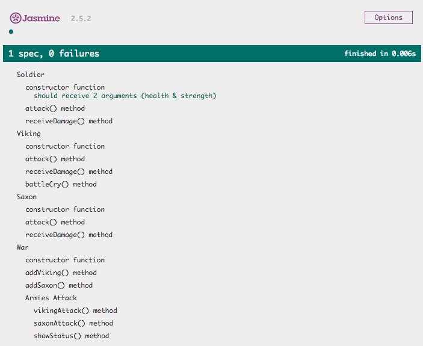

# JS | Vikings *Object Oriented Programming*

## Introduction

We have learned Object Oriented Programming and Prototypal inheritance with JavaScript. Now we will work with our Viking friends applying all the concepts we just learned today. Let's start with the exercise.

## Requirements

- [Fork this repo](https://guides.github.com/activities/forking/)
- Clone this repo into your `~/code/labs`
- Make sure you use objects and prototypal inheritance during the exercise.
- We should follow good object oriented principals.

## Submission

- Upon completion, run the following commands

```
git add .
git commit -m "done"
git push origin master
```

- Navigate to your repo and [create a Pull Request](https://help.github.com/articles/creating-a-pull-request/)

## Testing Introduction

### What is testing?

Software testing is a process of executing an application to validate and verify that it meets the business and technical requirements and works as expected.

Testing is a process, not a single activity. So the process of designing tests early at the beginning of the development and the product's life cycle can help to prevent deficiencies in the code or product design.

In this exercise, we have created all the tests you need to create the solution, and you have to execute them all and create the code to accomplish all the requirements.

Tests prove that your code actually works in every situation in which it’s designed to work. Even when you are improving the design or creating new features, you can change your current code without breaking what already works.

### Testing with Jasmine


Jasmine is an automated testing framework for JavaScript. It is designed to be used in BDD (behavior-driven development) programming which focuses more on the business value than on the technical details.

We have already included Jasmine in the project you just forked, so let's see how to use it to implement our code.

### Usage

Before start coding, we will explain the project structure we have provided you:

```
starter-code/
├── lib
│   ├── jasmine-2.5.2/
│   |   └── ...
│   ├── .gitkeep
│   └── jquery-3.1.1.min.js
├── spec
│   └── VikingSpec.js
├── src
│   └── viking.js
└─ SpecRunner.html
```

We are going to be working with the files inside the `spec` and `src` folders. In the `lib` folder you can find all the files that compose Jasmine, that are already linked with the `SpecRunner.html` file.

**Run tests**

Run the tests with Jasmine is super easy, you just have to open the `SpecRunner.html` file in your browser. You will find something like this:


We've got a _test suite_ for our constructor functions and their methods but there are no tests currently being executed. We have to uncomment each `it()` inside of `spec/VikingSpec.js` and implement the code in `src/viking.js` to make each test pass.

If you open `spec/VikingSpec.js` and take a look at **lines 10-20**. You should see some `it()` functions (tests) that are commented out. Let's start by uncommenting **lines 10-12**:

```javascript
  describe("constructor function", function () {
    it("should receive 2 arguments (health & strength)", function () {
      expect(Soldier.length).toEqual(2);
    });

    // it("should receive the health property as its 1st argument", function () {
    //   expect(soldier.health).toEqual(health);
    // });

    // it("should receive the strength property as its 2nd argument", function () {
    //   expect(soldier.strength).toEqual(strength);
    // });
  });
```

Now that particular test (_should receive 2 arguments (health & strength)_) is failing!


**Write the code**

Now we have to write the correct code in the `src/viking.js` file to make the test pass. The starter code you will find in the file is the following:

```javascript
// Soldier
function Soldier () {}

// Viking
function Viking () {}

// Saxon
function Saxon () {}

// War
function War () {}
```

In this case, the test says that _Soldier constructor function should receive 2 arguments (health & strength)_, so we have to write the correct code that passes this test. Let's make the `Soldier` constructor function receive two arguments:

```javascript
// Soldier
function Soldier (healthArg, strengthArg) {}

// Viking
function Viking () {}

// Saxon
function Saxon () {}

// War
function War () {}
```

Once we have implemented the correct code, we can refresh the `SpecRunner.html` page to see how our tests are passing.




**Execute all the tests**

Now that we are passing the first test, the next step is to uncomment the next test. To do that, we have to remove the comments from **lines 15-17** in the `spec/VikingSpec.js` file, and refresh the page to see what we have to implement next:


Once we have checked out that the test is failing, we can implement the code to make it pass. This is how [TDD (Test-driven development)](https://en.wikipedia.org/wiki/Test-driven_development) works. Once you have implemented the code to pass all the tests, the exercise will be done.

**Note this is a very big picture about Jasmine and TDD. We will learn how to use Jasmine in the future lessons of the course :)**

## Exercise


--------------------------------------------------------------------------------


### Soldier

Modify the `Soldier` constructor function and add 2 methods to its prototype: `attack()`, and `receiveDamage()`.

#### constructor function
- should receive **2 arguments** (health & strength)
- should receive the **`health` property** as its **1st argument**
- should receive the **`strength` property** as its **2nd argument**

#### `attack()` method
- should be a function
- should receive **0 arguments**
- should return **the `strength` property of the `Soldier`**

#### `receiveDamage()` method
- should be a function
- should receive **1 argument** (the damage)
- should remove the received damage from the `health` property
- **shouldn't return** anything


--------------------------------------------------------------------------------


### Viking

A `Viking` is a `Soldier` with an additional property, their `name`. They also have a different `receiveDamage()` method and new method, `battleCry()`.

Modify the `Viking` constructor function, have it inherit from `Soldier`, reimplement the `receiveDamage()` method for `Viking`, and add a new `battleCry()` method.

#### inheritance
- `Viking` should inherit from `Soldier` 

#### constructor function
- should receive **3 arguments** (name, health & strength)
- should receive the **`name` property** as its **1st argument**
- should receive the **`health` property** as its **2nd argument**
- should receive the **`strength` property** as its **3rd argument**

#### `attack()` method

(This method should be **inherited** from `Soldier`, no need to reimplement it.)

- should be a function
- should receive **0 arguments**
- should return **the `strength` property of the `Viking`**

#### `receiveDamage()` method

(This method needs to be **reimplemented** for `Viking` because the `Viking` version needs to have different return values.)

- should be a function
- should receive **1 argument** (the damage)
- should remove the received damage from the `health` property
- **if the `Viking` is still alive**, it should return **"NAME has received DAMAGE points of damage"**
- **if the `Viking` dies**, it should return **"NAME has died in act of combat"**

#### `battleCry()` method

[Learn more about battle cries](http://www.artofmanliness.com/2015/06/08/battle-cries/).

- should be a function
- should receive **0 arguments**
- should return **"Odin Owns You All!"**


--------------------------------------------------------------------------------


### Saxon

A `Saxon` is a weaker kind of `Soldier`. Unlike a `Viking`, a `Saxon` has no name. Their `receiveDamage()` method will also be different than the original `Soldier` version.

Modify the `Saxon`, constructor function, have it inherit from `Soldier` and reimplement the `receiveDamage()` method for `Saxon`.

#### inheritance
- `Saxon` should inherit from `Soldier`

#### constructor function
- should receive **2 arguments** (health & strength)
- should receive the **`health` property** as its **1st argument**
- should receive the **`strength` property** as its **2nd argument**

#### `attack()` method

(This method should be **inherited** from `Soldier`, no need to reimplement it.)

- should be a function
- should receive **0 arguments**
- should return **the `strength` property of the `Saxon`**

#### `receiveDamage()` method

(This method needs to be **reimplemented** for `Saxon` because the `Saxon` version needs to have different return values.)

- should be a function
- should receive **1 argument** (the damage)
- should remove the received damage from the `health` property
- **if the Saxon is still alive**, it should return _**"A Saxon has received DAMAGE points of damage"**_
- **if the Saxon dies**, it should return _**"A Saxon has died in combat"**_


--------------------------------------------------------------------------------


### (BONUS) War

Now we get to the good stuff: WAR! Our `War` constructor function will allow us to have a `Viking` army and a `Saxon` army that battle each other.

Modify the `War` constructor and add 5 methods to its prototype:
- `addViking()`
- `addSaxon()`
- `vikingAttack()`
- `saxonAttack()`
- `showStatus()`

#### constructor function

When we first create a `War`, the armies should be empty. We will add soldiers to the armies later.

- should receive **0 arguments**
- should assign an empty array to the **`vikingArmy` property**
- should assign an empty array to the **`saxonArmy` property**

#### `addViking()` method

Adds 1 `Viking` to the `vikingArmy`. If you want a 10 `Viking` army, you need to call this 10 times.

- should be a function
- should receive **1 argument** (a `Viking` object)
- should add the received `Viking` to the army
- **shouldn't return** anything

#### `addSaxon()` method

The `Saxon` version of `addViking()`.

- should be a function
- should receive **1 argument** (a `Saxon` object)
- should add the received `Saxon` to the army
- **shouldn't return** anything

#### `vikingAttack()` method

A `Saxon` (chosen at random) has their `receiveDamage()` method called with the damage equal to the `strength` of a `Viking` (also chosen at random). This should only perform a single attack and the `Saxon` doesn't get to attack back.

- should be a function
- should receive **0 arguments**
- should make a `Saxon` `receiveDamage()` equal to the `strength` of a `Viking`
- should remove dead saxons from the army
- should return **result of calling `receiveDamage()` of a `Saxon`** with the `strength` of a `Viking`

#### `saxonAttack()` method

The `Saxon` version of `vikingAttack()`. A `Viking` receives the damage equal to the `strength` of a `Saxon`.

- should be a function
- should receive **0 arguments**
- should make a `Viking` `receiveDamage()` equal to the `strength` of a `Saxon`
- should remove dead vikings from the army
- should return **result of calling `receiveDamage()` of a `Viking`** with the `strength` of a `Saxon`

#### `showStatus()` method

Returns the current status of the `War` based on the size of the armies.

- should be a function
- should receive **0 arguments**
- **if the `Saxon` array is empty**, should return _**"Vikings have won the war of the century!"**_
- **if the `Viking` array is empty**, should return _**"Saxons have fought for their lives and survive another day..."**_
- **if there are at least 1 `Viking` and 1 `Saxon`**, should return _**"Vikings and Saxons are still in the thick of battle."**_


--------------------------------------------------------------------------------


**//Happy Coding!!**


