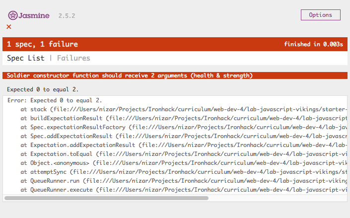
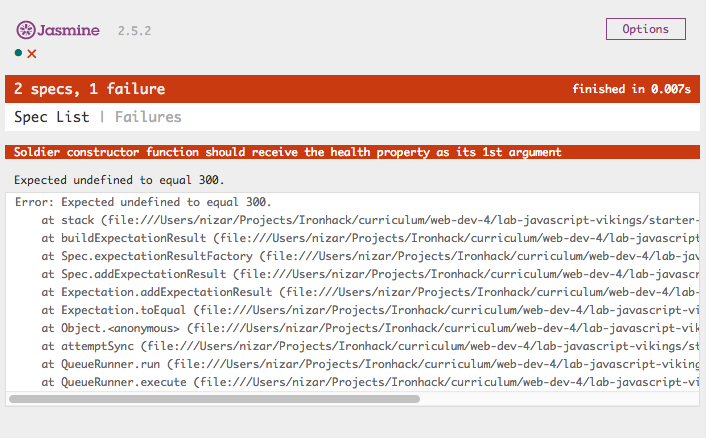

# LAB | JS Vikings _Object-oriented programming_

## Introduction

We have learned Object-oriented programming and how `class` and inheritance work in JavaScript. Now lets work with our Viking friends, applying all of the concepts we've just learned.

## Requirements

- Fork this repo
- Clone this repo

## Submission

Upon completion, run the following commands:
```
$ git add .
$ git commit -m "done"
$ git push origin master
```
Create Pull Request so your TAs can check up your work.

### Test, test, test!

Yes! The best way to ensure your code is doing what is expected is to constantly test. Go ahead and open the file `SpecRunner.html`!

__Run the tests__

We've got a _test suite_ for our constructor functions and their methods but there are no tests currently being executed. We have to uncomment each `it()` inside of `tests/VikingSpec.js` and implement the code in `src/viking.js` to make each test pass.

If you open `tests/VikingSpec.js` and take a look at __lines 11-21__, You should see some `it()` calls (tests) that are commented out. Let's start by uncommenting __lines 11-13__:

```javascript
describe('constructor function', () => {
  it('should receive 2 arguments (health & strength)', () => {
    expect(Soldier.length).toEqual(2);
  });

  // it('should receive the health property as its 1st argument', () => {
  //   expect(soldier.health).toEqual(health);
  // });

  // it('should receive the strength property as its 2nd argument', () => {
  //   expect(soldier.strength).toEqual(strength);
  // });
});
```

Now that particular test (_should receive 2 arguments (health & strength)_) is failing!



__Write the code__

We must write the correct code in the `src/viking.js` file to make the test pass. The starter code you will find in the file is the following:

```javascript
// Soldier
class Soldier {}

// Viking
class Viking {}

// Saxon
class Saxon {}

// War
class War {}
```

In this case, the test says that _Soldier class should receive 2 arguments (health & strength)_, so we have to write the correct code that passes this test. Let's make the `Soldier` class receive two arguments:

```javascript
// Soldier
class Soldier {
  constructor(health, strength) {}
}

// Viking
class Viking {}

// Saxon
class Saxon {}

// War
class War {}
```

__Execute all the tests__

Now that we are passing the first test, the next step is to uncomment the next test. To do that, we have to remove the comments from __lines 15-17__ in the `spec/VikingSpec.js` file, and refresh the page to see what we have to implement next.
Once we've verified that the test is failing, we can implement the code to make it pass.

<!--  -->

## Exercise


---

### Soldier

Modify the `Soldier` class and add 2 methods to it: `attack()`, and `receiveDamage()`.

#### class

- should receive __2 arguments__ (health & strength)
- should receive the __`health` property__ as its __1st argument__
- should receive the __`strength` property__ as its __2nd argument__

#### `attack()` method

- should be a function
- should receive __0 arguments__
- should return __the `strength` property of the `Soldier`__

#### `receiveDamage()` method

- should be a function
- should receive __1 argument__ (the damage)
- should remove the received damage from the `health` property
- __shouldn't return__ anything

---

### Viking

A `Viking` is a `Soldier` with an additional property, their `name`. They also have a different `receiveDamage()` method and new method, `battleCry()`.

Modify the `Viking` class, have it inherit from `Soldier`, re-implement the `receiveDamage()` method for `Viking`, and add a new `battleCry()` method.

#### inheritance

- `Viking` should __extend__ `Soldier`

#### class

- should receive __3 arguments__ (name, health & strength)
- should receive the __`name` property__ as its __1st argument__
- should receive the __`health` property__ as its __2nd argument__
- should receive the __`strength` property__ as its __3rd argument__

#### `attack()` method

(This method should be __inherited__ from `Soldier`, no need to re-implement it.)

- should be a function
- should receive __0 arguments__
- should return __the `strength` property of the `Viking`__

#### `receiveDamage()` method

(This method needs to be __re-implemented__ for `Viking` because the `Viking` version needs to have different return values.)

- should be a function
- should receive __1 argument__ (the damage)
- should remove the received damage from the `health` property
- __if the `Viking` is still alive__, it should return __"NAME has received DAMAGE points of damage"__
- __if the `Viking` dies__, it should return __"NAME has died in act of combat"__

#### `battleCry()` method

[Learn more about battle cries](http://www.artofmanliness.com/2015/06/08/battle-cries/).

- should be a function
- should receive __0 arguments__
- should return __"Odin Owns You All!"__

---

### Saxon

A `Saxon` is a weaker kind of `Soldier`. Unlike a `Viking`, a `Saxon` has no name. Their `receiveDamage()` method will also be different than the original `Soldier` version.

Modify the `Saxon`, constructor function, have it inherit from `Soldier` and re-implement the `receiveDamage()` method for `Saxon`.

#### inheritance

- `Saxon` should extend `Soldier`

#### class

- you don't have to include constructor method since this class will inherit perfectly from the parents class, both, the health and the strength (it `extends` Soldier class :wink: )

#### `attack()` method

(This method should be __inherited__ from `Soldier`, no need to re-implement it.)

- should be a function
- should receive __0 arguments__
- should return __the `strength` property of the `Saxon`__

#### `receiveDamage()` method

(This method needs to be __re-implemented__ for `Saxon` because the `Saxon` version needs to have different return values.)

- should be a function
- should receive __1 argument__ (the damage)
- should remove the received damage from the `health` property
- __if the Saxon is still alive__, it should return ___"A Saxon has received DAMAGE points of damage"___
- __if the Saxon dies__, it should return ___"A Saxon has died in combat"___

---

### BONUS: War

Now we get to the good stuff: WAR! Our `War` class will allow us to have a `Viking` army and a `Saxon` army that battle each other.

Modify the `War` class and add 5 methods to its `class`:

- `addViking()`
- `addSaxon()`
- `vikingAttack()`
- `saxonAttack()`
- `showStatus()`

#### class

When we first create a `War`, the armies should be empty. We will add soldiers to the armies later.

- should receive __0 arguments__
- should assign an empty array to the __`vikingArmy` property__
- should assign an empty array to the __`saxonArmy` property__

#### `addViking()` method

Adds 1 `Viking` to the `vikingArmy`. If you want a 10 `Viking` army, you need to call this 10 times.

- should be a function
- should receive __1 argument__ (a `Viking` object)
- should add the received `Viking` to the army
- __shouldn't return__ anything

#### `addSaxon()` method

The `Saxon` version of `addViking()`.

- should be a function
- should receive __1 argument__ (a `Saxon` object)
- should add the received `Saxon` to the army
- __shouldn't return__ anything

#### `vikingAttack()` method

A `Saxon` (chosen at random) has their `receiveDamage()` method called with the damage equal to the `strength` of a `Viking` (also chosen at random). This should only perform a single attack and the `Saxon` doesn't get to attack back.

- should be a function
- should receive __0 arguments__
- should make a `Saxon` `receiveDamage()` equal to the `strength` of a `Viking`
- should remove dead saxons from the army
- should return __result of calling `receiveDamage()` of a `Saxon`__ with the `strength` of a `Viking`

#### `saxonAttack()` method

The `Saxon` version of `vikingAttack()`. A `Viking` receives the damage equal to the `strength` of a `Saxon`.

- should be a function
- should receive __0 arguments__
- should make a `Viking` `receiveDamage()` equal to the `strength` of a `Saxon`
- should remove dead vikings from the army
- should return __result of calling `receiveDamage()` of a `Viking`__ with the `strength` of a `Saxon`

#### SUPER BONUS

Since there is a lot of repetitive code in the previous two iterations, _vikingAttack()_ and _saxonAttack()_ try to create one _generic_ method and call it in the case of _vikingAttack_ and in the case of _saxonAttack_ instead of using almost the same code for both methods. (This iteration doesn't have test, so ask your TAs and your instructor to give you feedback on the quality of your code after the refactor.)

#### `showStatus()` method

Returns the current status of the `War` based on the size of the armies.

- should be a function
- should receive __0 arguments__
- __if the `Saxon` array is empty__, should return ___"Vikings have won the war of the century!"___
- __if the `Viking` array is empty__, should return ___"Saxons have fought for their lives and survived another day..."___
- __if there are at least 1 `Viking` and 1 `Saxon`__, should return ___"Vikings and Saxons are still in the thick of battle."___

---

__Happy Coding!__ 💙


